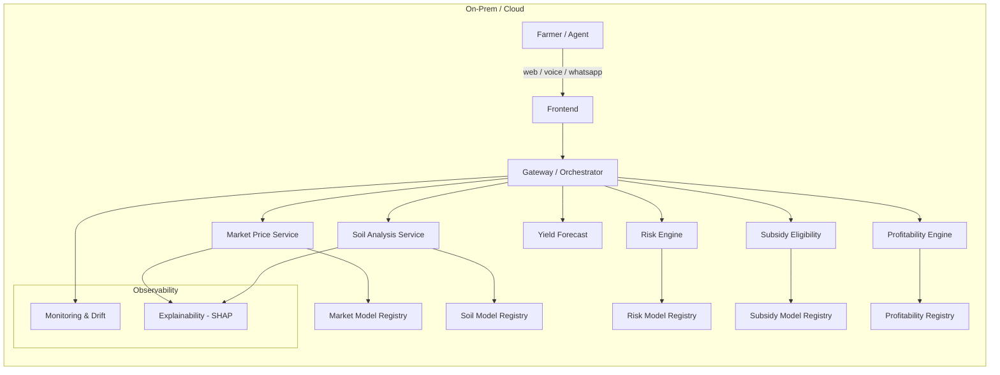
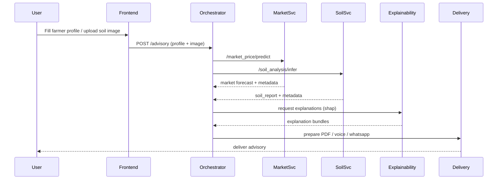
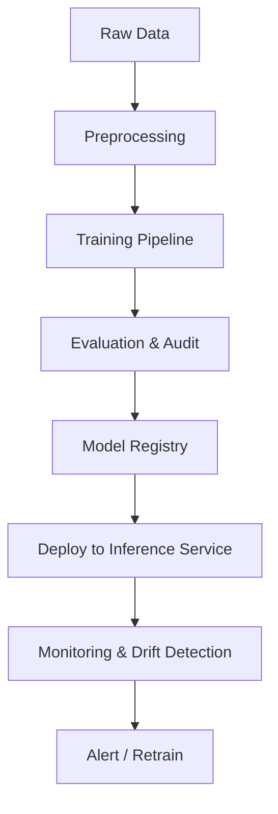

# Agri‑AI — Intelligent Agricultural Decision Platform

[](LICENSE) [](#) [](#)

A production‑grade, modular platform that brings machine learning, explainability and delivery mechanisms to agricultural decision-making. Agri‑AI delivers field‑ready advisory intelligence across market forecasting, soil analysis, crop recommendations, risk assessment, subsidy eligibility and profitability planning — with reproducible training pipelines, model registries, monitoring and low‑connectivity delivery adapters.

Contact / Access
- To request access, collaboration or a demo, email: yuvanchaudary2004@gmail.com

---

Table of contents
- Project snapshot
- Architecture (high level)
- Flow & sequence diagrams
- Project structure (tree)
- Setup & quickstart
- Verification, testing & validation
- Deployment (local / docker)
- Contributing
- License

---

Project snapshot

- Tech stack: Python 3.10+, FastAPI-style microservices, SHAP explainability, joblib/torch model artifacts, Vite + React frontend (TypeScript), Docker.
- Key capabilities: market price forecasting, soil analysis (vision + features), yield forecasting, risk scoring, subsidy eligibility, profitability calculator, report delivery (PDF/IVR/WhatsApp).
- Production features: model registry, calibration, monitoring (drift), explainability and offline delivery adapters.

---

Architecture (high level)

This section describes the main components, responsibilities and data flow.



Architecture notes
- Each domain exposes a small inference service (models/*/*/api). A central orchestrator aggregates results and composes advisory responses.
- Explainability modules attach SHAP summaries (global + local) to outputs for transparency.
- Monitoring pipelines compute PSI/feature drift and surface alerts under monitoring/reports.

---

Flow diagrams

1) End‑user request -> advisory flow



2) Training & registry lifecycle



---

Project structure (concise)

- api/                       — API adapters and lightweight services
- frontend/                  — Vite + React frontend (dashboard, charts, forms)
- models/                    — Model serving code and artifacts
  - market_price/
  - soil_analysis/
  - risk_engine/
  - subsidy_eligibility/
  - profitability_engine/
  - crop_intelligence/
  - shared/                  — shared code (agents, inference, delivery, orchestrator)
- training/                  — Training pipelines & scripts
- monitoring/                — Drift detectors, monitoring reports
- explainability/            — SHAP explainers and utilities
- data_pipeline/             — dataset generation, certification, feature pushers
- docs/                      — dataset dictionary, schema & generation rules
- artifacts/                 — example advisories, audit manifests
- tests/                     — unit, integration and E2E specs

A fuller tree is available in project_structure.txt and Architecture_Blueprint.md.

---

Setup & Quickstart (developer)

Prerequisites
- Python 3.10+
- Node 18+
- Git
- Docker & docker-compose (optional but recommended)

Local virtualenv + backend

1. Clone the repo

   git clone https://github.com/YuvanChaudary/Agri-AI.git
   cd Agri-AI

2. Create virtual environment and install

   python -m venv .venv
   source .venv/bin/activate  # Windows: .venv\Scripts\activate
   pip install -r requirements.txt

3. Run a single model service (e.g., market_price)

   python models/market_price/api/main.py

4. Frontend

   cd frontend
   npm install
   npm run dev

5. End‑to‑end demo (if available)

   python run_e2e_demo.py

Docker (local compose)

- Build and run full stack locally

   docker-compose up --build

Environment variables
- See docs/API_KEYS.txt and frontend README for any required API keys and service endpoints. Do not commit secrets to the repository.

---

Verification, testing & validation

- Unit tests: run pytest
- Frontend tests / E2E: check tests/ (Cypress / Playwright specs) — run via npm test / npm run e2e
- Model validation: each model folder contains evaluation metrics and audit reports under *_artifacts* and *_registry*; use the training scripts in training/ to reproduce runs.
- Drift & monitoring: monitoring/ contains PSI detectors and sample reports; use monitoring scripts to re-check production snapshots.

Recommended verification checklist for releases
1. Run unit tests: pytest -q
2. Run model evaluation for each changed model and confirm metrics meet thresholds
3. Run explainability snapshot (SHAP) and verify top features
4. Run a smoke E2E demo and capture screenshots (helps for release notes)

---

Stunning README extras (optional, recommended)
- Add CI badges (GitHub Actions / Build / Coverage) for credibility
- Embed screenshots or an animated GIF from tests/screenshots/ to showcase the UI
- Add a short API example block (curl) for market price and soil inference

Example API request (market price)

```bash
curl -X POST https://{API_HOST}/market_price/predict \
  -H "Content-Type: application/json" \
  -d '{"crop":"rice","location":"district-123","start_date":"2026-07-01"}'
```

---

Contributing

We welcome improvements. Recommended flow:
1. Fork the repo
2. Create a feature branch: git checkout -b feat/awesome
3. Run tests & linters
4. Open a PR with a clear description, test cases and a screenshot (if applicable)

Consider adding: CONTRIBUTING.md, CODE_OF_CONDUCT.md and a PR template for structured contributions.

---

License

This project is licensed under the MIT License. See LICENSE for details.

---

Contact

For access or collaboration: yuvanchaudary2004@gmail.com

If you want, I can now:
- Render the Mermaid diagrams to SVG/PNG and add them to docs/ (visuals for the README)
- Add CI badges and a release checklist
- Insert example request/response JSON payloads for the most-used endpoints
